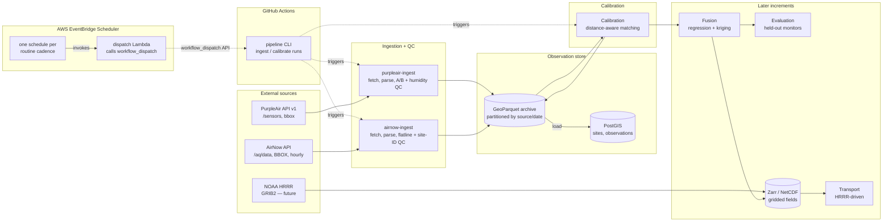

# High-Level Design: Air Quality Digital Twin

## Problem

Regulatory air-quality monitoring in the Washington, D.C. metro area is sparse: an EPA AirNow
bounding-box query over the metro returns on the order of five reference monitors, reporting hourly.
Low-cost crowdsourced PurpleAir sensors are dense — over a hundred in the same box, reporting every
~2 minutes — but individually unreliable: they need humidity correction, a meaningful fraction
exhibit hardware faults (one of the two internal laser channels drifting into the thousands of
µg/m³ while the other reads single digits), and their raw values are not directly comparable to
regulatory measurements.

Neither source alone gives a trustworthy, spatially continuous picture of PM2.5 across the metro.
A digital twin that fuses them — dense-but-noisy sensors calibrated against sparse-but-trusted
monitors, on a surface that can later be driven forward by NOAA HRRR wind and boundary-layer fields
— would.

The project is built incrementally as weekly assignments for GGS 590 (Digital Twins, George Mason
University). Each increment must land as a coherent, tested, reproducible step.

## Approach

### Observational fusion, built up in layers

The twin is a pipeline of data assets, each derived from the ones before it:

1. **Ingestion** pulls raw observations from each external source into an immutable archive.
2. **Quality control** annotates every observation with flags — never silently discarding — so
   downstream stages choose what to trust and the raw record is always recoverable.
3. **Calibration** corrects PurpleAir readings against nearby AirNow reference monitors, with
   distance-aware sensor-to-monitor matching.
4. **Fusion** produces an hourly PM2.5 surface over the metro (regression + kriging over the
   calibrated observations).
5. **Transport** (future) uses HRRR wind and boundary-layer fields to advect the surface forward
   as a short-range forecast.
6. **Evaluation** scores the surface against held-out reference monitors.

Layers 1–3 are implemented for PurpleAir and AirNow, together with the scheduled runs that feed
them. Layers 4–6 are designed at this level only so that the earlier layers do not foreclose them.

### Idempotent, time-windowed batch

Every pipeline step is a pure function of *(inputs, time window)* that can be re-run for the same
window and produce the same result. Each step is invoked through one command-line entry point,
on demand or on a schedule; the pipeline is not a resident daemon. Every run still executes on a
GitHub Actions runner, which needs no host of its own — the development environment (GitHub
Codespaces) idles out and is periodically rebuilt, so nothing that must keep running can live
there. Scheduled runs are triggered by AWS EventBridge Scheduler, which dispatches each run
through GitHub's `workflow_dispatch` API at the cadence its routine window expects (see Execution
model below). This matches the way most scientific data pipelines are operated and makes each
step a ready-made asset for a workflow orchestrator once backfills and lineage are needed.

### Domain-standard methods, interoperable formats

Where EPA, NOAA, or the atmospheric-science community has an established method or format, the
project uses it rather than inventing one: EPA's PurpleAir correction and channel-agreement criteria
(Barkjohn et al. 2021), AQS site identifiers, GeoParquet for point observations, PostGIS for spatial
query, CF-convention NetCDF/Zarr for gridded fields. Every stored artifact must be readable by
standard GIS and scientific tooling (QGIS, GeoPandas, xarray) without this project's code.

## Target Users

- **The pipeline author** (a single developer, weekly increments): needs each step to be
  independently testable, re-runnable, and inspectable, so that a week's work is a clean,
  demonstrable slice.
- **A reviewer or collaborator from an air-quality or GIS background**: needs to open the archive
  or the PostGIS tables in familiar tools and see raw values, QC flags, and provenance without
  reading Python.
- **Downstream pipeline stages** (calibration, fusion, transport): need a canonical observation
  schema with precise coordinates, stable source identifiers, timestamps, raw values, and QC flags,
  so that spatial joins and distance-aware matching are straightforward.

## Goals

- Every PurpleAir and AirNow observation for the D.C. metro bounding box is captured into a
  partitioned GeoParquet archive with its raw payload fields preserved.
- Every archived observation carries QC flags produced by domain-standard checks; the flag rate on
  PurpleAir channel disagreement is consistent with the observed hardware-fault rate (a few
  percent), and no AirNow flatline or malformed site identifier reaches downstream stages
  unflagged.
- AirNow site identifiers are normalized so that 100% of sites join to a single canonical site
  record.
- Re-running ingestion for the same time window is idempotent: the archive and the PostGIS tables
  are unchanged.
- The PostGIS serving layer is rebuildable from the archive with one command, and a fresh Codespace
  reaches a working, populated state from `postCreateCommand` alone.
- The observation schema carries everything the calibration layer needs for distance-aware
  matching: WGS84 coordinates at full source precision, source identity, timestamp, humidity,
  raw PM2.5 per channel.
- The pipeline runs unattended: scheduled runs keep the archive current with no manual step, and
  a failed run is visible where the schedule lives.

## Non-Goals

- **No physical baseline concentration model.** The fusion layer is purely observational. There is
  no emissions-driven dispersion model (no equivalent of EPISODE in O'Regan et al. 2026) providing
  a prior PM2.5 surface. A simple emissions proxy may be scoped in a later phase; nothing in the
  current design assumes one.
- **No background / boundary PM2.5.** Nothing represents PM2.5 entering the domain from outside it
  (no equivalent of CAMS). This is a known limitation of the fused surface.
- **No resident real-time service.** "Real-time" means the latest available observations as of the
  most recent scheduled or on-demand run, not a continuously polling daemon. PurpleAir's ~2-minute
  native cadence is not captured continuously.
- **No workflow orchestrator yet.** Scheduled runs are dispatched directly and wrapped by nothing;
  Dagster is the intended target once backfills and lineage across a running pipeline are needed.
- **No gridded data in PostGIS.** HRRR and any derived surfaces are stored as CF-convention
  NetCDF/Zarr and handled with xarray; PostGIS holds point observations and site metadata only.
- **No user-facing application.** Outputs are data assets consumable by QGIS, notebooks, and
  downstream stages.

## Tenets

Ordered: when two conflict, the higher one wins.

- **Flag, never drop.** When an observation fails a quality check, annotate it and keep it; the raw
  record stays recoverable and downstream stages decide what to trust.
- **Domain-standard over bespoke.** When EPA, NOAA, or the community has an established method,
  identifier scheme, or format, use it before inventing a project-specific one, even when the
  bespoke version would be simpler here.
- **Interoperable over convenient.** Stored artifacts must open in standard GIS and scientific
  tooling without this project's code; a format that only this pipeline can read is the wrong
  format.
- **Rebuildable over durable.** Any stored state must be reconstructible from the archive and the
  source APIs; treat databases and environments as disposable caches rather than systems of
  record.

## System Design

### Components

**Source ingesters** (one per external source). Each owns everything specific to its source: API
client and authentication, bounding-box query, parsing the source's native payload, the source's
domain-standard QC rules, and mapping to the canonical observation schema. Rules that exist because
of one source's quirks live with that source. Current ingesters: `purpleair-ingest`,
`airnow-ingest`.

**Observation store.** Owns the canonical observation and site schemas, the shared QC flag
vocabulary, the GeoParquet archive layout (partitioning, file naming, idempotent writes), and the
load into PostGIS. Ingesters write to the store; nothing else does. The archive, held in S3, is the
system of record; PostGIS, running inside the Codespace, is a rebuildable serving layer for
spatial query and GIS tooling.

**Calibration.** Reads trusted observations from the archive, aggregates PurpleAir snapshots to
hours, matches each sensor to its nearest reference monitor by distance, fits per-sensor
corrections, and writes its products back through the store's primitives, so that PostGIS serves
them and stays rebuildable from the archive alone.

**Pipeline.** The one command-line entry point through which every run is invoked, the routine
window each run covers when invoked on a schedule, and the schedules themselves. It owns no data;
it decides *when* and *over what window* the other components execute.

**Fusion, transport, evaluation** — later increments, each a separate component following the
calibration pattern: read from the archive, write products back through the store. Named here so
the store's schema is designed for them.

### Data flow per run

A run is parameterized by a source and a time window. For AirNow the window maps directly to the
API's date range and a run backfills any hours the archive lacks. For PurpleAir the `/sensors`
endpoint returns each sensor's latest reading only, so a run captures a snapshot; time-series depth
for PurpleAir accumulates through repeated runs, and snapshot polls that return an unchanged reading
(same sensor, same `last_seen`) do not create duplicate observations.

On a schedule, each run covers a routine window that needs no argument: PurpleAir polls a snapshot
several times an hour; AirNow re-fetches a trailing window at least as long as the period the
feed keeps revising; calibration refits once a day and re-applies over a trailing window each
hour. Because every run is idempotent and windows overlap their predecessors, a missed or delayed
scheduled run costs nothing but latency — the next run covers the gap. Any window can also be
requested explicitly for backfill.

History serves two distinct needs with different depth requirements. Fitting calibration models and
evaluating the fused surface need a deep archive, built up during an initial polling period.
Operating the twin thereafter needs only a bounded recent window (the latest observations plus
enough history for flatline detection and the current calibration fit). The archive keeps
everything; operational stages read a window, so history depth is never a runtime prerequisite.

### Environment

Two environments run the pipeline's own code and share one codebase and one archive; a third,
minimal environment exists only to trigger it.

**Scheduled runs** execute on GitHub Actions runners: a workflow per run checks out the
repository, installs it, and invokes the pipeline entry point against the S3 archive, whether
invoked by a scheduled dispatch or a manual `workflow_dispatch` call. Runners have no PostGIS, so
scheduled runs write the archive only. API keys, AWS credentials, and the archive URI are
repository secrets.

**Scheduling** is driven by AWS EventBridge Scheduler, one schedule per routine cadence, each
invoking a small Lambda that calls GitHub's `workflow_dispatch` API for the corresponding
workflow. The Lambda holds a GitHub PAT scoped to `actions:write` on this repository, stored in
AWS Secrets Manager and fetched at invoke time; it carries no pipeline logic and never touches the
archive or PostGIS. The workflows carry no `schedule:` cron trigger at all — a trigger that drops
most of its occurrences is not a working backup, and leaving it in the YAML would read as one to a
future maintainer. `workflow_dispatch` is the only trigger each workflow declares, invoked by the
Lambda on a schedule or by a human on demand.

**Development and serving** happen in a GitHub Codespace defined by the devcontainer. A Codespace
and everything inside it — workspace files, Docker volumes — is deleted after a period of
inactivity, so nothing inside it is durable. PostGIS runs as a docker-compose sidecar service;
`postCreateCommand` creates the schema and loads the archive from S3, so a new Codespace comes up
populated, and the same rebuild refreshes a long-lived Codespace with what the schedules have
archived since. The same secrets are supplied as Codespaces secrets, never files.

CI (GitHub Actions) runs lint and tests against a Postgres+PostGIS service container and an
in-process S3 mock, with no cloud credentials.

### Design tree

Depth-2: this HLD over flat leaf LLDs under `docs/intent/`, one folder per leaf, each owning its
EARS prefix.

| Leaf | Prefix | Owns |
|---|---|---|
| `observation-store` | `OBS` | canonical schemas, flag vocabulary, archive layout, PostGIS load |
| `purpleair-ingest` | `PA` | PurpleAir client, parsing, A/B agreement and humidity QC |
| `airnow-ingest` | `AN` | AirNow client, parsing, flatline and site-identifier QC |
| `calibration` | `CAL` | hourly aggregation, distance-aware sensor-to-monitor matching, per-sensor fits |
| `pipeline` | `PIPE` | the command-line entry point, routine windows, and the cadence each scheduled run follows |
| `infrastructure` | `INFRA` | the SAM stacks, the dispatch Lambda, and every AWS resource the twin depends on |

Later increments add leaves (`fusion`, `transport`, `evaluation`) beside these.

## Key Design Decisions

### Execution model: idempotent time-windowed batch, triggered by AWS EventBridge, executed by GitHub Actions

Each step is a function of *(inputs, time window)*, invoked through one command-line entry point,
and safe to repeat. Execution is on GitHub Actions runners: they need no host, cost nothing on a
public repository, and put every run's log beside the code.

The trigger is separate from the executor, because GitHub Actions' own `schedule:` cron trigger is
not dependable enough to keep the archive current — it drops most occurrences outright rather than
running them late, leaving multi-hour gaps at a nominal 15-minute cadence. AWS EventBridge
Scheduler, a managed cron that fires to the minute, holds one schedule per routine cadence
(PurpleAir every 15 minutes, AirNow and calibrate-apply hourly, calibrate-fit daily) and invokes a
small Lambda that calls GitHub's `workflow_dispatch` REST API for the matching workflow.
`workflow_dispatch` is the only trigger the workflows declare, so there is exactly one scheduled
path and it is the reliable one.

Timing precision beyond this is unnecessary: no consumer needs PurpleAir's two-minute native
cadence, since calibration aggregates PurpleAir to hours and imposes no minimum snapshot count, so
a few snapshots per hour suffice, and every run's window overlaps its predecessor so a late or
missed run is recovered by the next. Concurrent runs are safe from any trigger because the archive
itself guarantees one writer per partition (the store's writes are compare-and-swap: a partition
changed under a writer is re-read and re-merged, never overwritten); concurrency groups serialize
each workflow with itself only so that two runs over the same window do not both spend runner
minutes.

A workflow orchestrator (Dagster) is the intended eventual wrapper, sitting on the same entry
points, once backfills and lineage across a running pipeline are needed.

### Persistence: GeoParquet archive as system of record, PostGIS as serving layer

Point observations are written to a partitioned GeoParquet archive in S3 (durable, reproducible,
readable by GeoPandas/DuckDB/QGIS directly from object storage, and safe for concurrent writers
through S3's conditional writes) and loaded into PostGIS (spatial SQL for distance-aware
matching, native QGIS connectivity).

Both stores earn their place. The archive lives in durable object storage because the Codespace
database does not outlive the Codespace, and the archive is what makes the twin reproducible; it
stays out of the workspace and out of git because binary Parquet would churn on every run. PostGIS
is the serving layer because sensor-to-monitor matching and site joins are spatial queries best
expressed in SQL, and because it is the interoperability target for GIS tooling. The cost of two
stores is a load step and a schema sync to keep tested.

### QC: source-specific rules, shared flag vocabulary, flag-never-drop

Each ingester applies the checks its source needs, using published criteria where they exist
(Barkjohn et al. 2021 for PurpleAir channel agreement and humidity correction). Results are
recorded as flag columns on the observation; raw values are never modified or removed, because
filtering at ingestion destroys provenance. QC runs inline with ingestion rather than as a later
pass, so faulty data is never live in the store unflagged. The flag vocabulary is shared across
sources so downstream stages filter uniformly; with two sources, each ingester holds its own rules
directly rather than registering them with a framework.

### Fusion is observational; no dispersion baseline

The reference architecture (O'Regan et al. 2026) fuses sensors and monitors on top of a physical
dispersion model's baseline surface. This project has no such model — HRRR supplies transport
fields, not a concentration prior — and the fusion layer is designed to work from observations
alone. Scoping in a simple emissions proxy is a possible later decision, not a design assumption.

### Calibration is distance-aware from the outset

The D.C. metro is large and has several reference monitors, so which monitor a sensor is compared
against matters: each PurpleAir sensor is matched to its nearest reference monitor within a
radius, with a pooled network-wide fit for sensors that have none. This is recorded at HLD level
because it constrains the observation schema (full-precision coordinates, stable site identity).
Distances are computed from the archive in GeoPandas so that calibration stays a pure function of
the archive; PostGIS serves the results.

### Schemas: Pydantic for records, Pandera for frames

Validation happens where data crosses a boundary, and the two kinds of boundary get the library
built for them.

- **Pydantic** validates *objects*: each source's parsed API payload, the canonical `Site` and
  `Observation` records an ingester constructs, enumerations such as the QC flag vocabulary, and
  configuration. Pydantic models also yield JSON Schema, which constrains the inputs and outputs of
  any future AI/LLM component in the pipeline (structured outputs against the observation schema
  rather than free text).
- **Pandera** validates *dataframes*: every archive partition on write and read, and every frame
  handed to calibration, fusion, or evaluation. Pandera expresses what a record model cannot —
  uniqueness of `(site_id, observed_at)`, sortedness, cross-column consistency, geometry column
  type — and validates vectorized, which matters once the archive is deep.

The two definitions of the same schema must agree. Where one can be derived from the other, derive
it; where it cannot (frame-level checks have no record-level source), a conformance test asserts
that the Pydantic and Pandera definitions name the same columns with the same nullability and
compatible types. Each library covers what the other cannot: per-record validation is the wrong
shape for bulk reads and cannot state collection invariants, while frame validation is awkward for
nested API payloads and cannot export JSON Schema.

### Gridded fields live outside PostGIS

HRRR inputs and any fused/forecast surfaces are CF-convention NetCDF or Zarr handled with xarray,
which is the scientific tooling for gridded atmospheric data. PostGIS holds point observations
only; its raster support is a poor fit for time-stepped model output.

## Success Metrics

**Ingestion, QC, calibration, and scheduling:**

- Left alone, the schedules keep the archive current: every source has observations from the
  last few hours, and a daily fit and hourly calibrated values exist for every sensor.
- A fresh Codespace reaches a populated, queryable PostGIS from `postCreateCommand` alone.
- Two consecutive runs over the same window, with unchanged upstream data, produce byte-identical
  archive partitions and no new rows in PostGIS.
- Every PurpleAir observation whose channels disagree beyond the Barkjohn criteria carries the
  disagreement flag; the flagged fraction is a few percent, matching the observed fault rate.
- Every AirNow site record has a normalized identifier; every AirNow flatline (a run of identical
  values over several consecutive hours) carries the flatline flag.
- Every archived observation can be traced to the raw payload fields it came from.

**Falsification signals:**

- A channel-B hardware fault reaches a downstream stage unflagged.
- A rebuild of PostGIS from the archive differs from the live tables.
- An artifact in the store cannot be opened in QGIS or GeoPandas without project code.
- The archive goes stale — no new observations for a source over several hours — without a
  failed scheduled run saying so.

**Later increments:** leave-one-out cross-validation of the fused surface against held-out AirNow
monitors, reported against FAIRMODE model-quality objectives.

## References

- PurpleAir API v1 — `https://api.purpleair.com/v1/sensors` (bounding-box query via
  `nwlng`/`nwlat`/`selng`/`selat`; `X-API-Key` header).
- EPA AirNow API — `https://www.airnowapi.org/aq/data/` (`BBOX`, `dataType=A` hourly averages;
  data labeled preliminary/unvalidated).
- Barkjohn, K. K., Gantt, B., and Clements, A. L. (2021). *Development and application of a United
  States-wide correction for PM2.5 data collected with PurpleAir sensors.* Atmospheric Measurement
  Techniques, 14, 4617–4637.
- O'Regan et al. (2026). Fusion of PurpleAir sensors, regulatory monitors, and the EPISODE
  dispersion model via regression kriging for Cork, Ireland. *Environment International.*
  Reference architecture; deviations recorded under Key Design Decisions.
- NOAA HRRR (High-Resolution Rapid Refresh) — wind and boundary-layer fields for the transport
  layer.
- FAIRMODE model-quality objectives — evaluation standard for the fusion layer.
- GeoParquet specification; CF (Climate and Forecast) metadata conventions.
